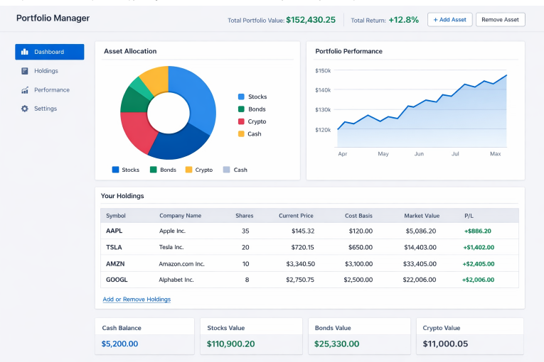

Portfolio Manager Training Project
[TOC]

Overview
Your team is challenged with designing an application to manage a financial portfolio.

The portfolio may contain some or all of stocks, bonds, cash etc.

Your task is to build the application.

Important: This project is designed as a learning experience. While you may use Generative AI tools to assist your development, you must follow professional standards appropriate for banking software development. Please review the mandatory Use of GenAI Guidelines. These guidelines ensure code quality, security, and most importantly, that you genuinely understand every line of code you write.

Technical Goals
You should aim to create a Portfolio Management REST API. This will be the main target for the training week where you learn about APIs.

This API should allow saving and retrieving records that describe the contents of a financial portofolio.

If/When you have made progress on the core requirements then requirements for further enhancements will be provided. This will included open-ended enhancements whereby you can make use of your particular skills and experience.

We will continue working on this project into the week where you start looking at Web front ends.

For the Front end, you can use the Technologies you have learnt about in your training. If you wish to use a specific framework or some other technology, please check with your instructor.

The Front end should facilitate your users to (in order of priority):

Browse a portfolio
View the performance of the portfolio (ideally in some graphical manner)
Add items to the portfolio
Remove items from the portfolio
In terms of detailed requirements, your instructor will act as customer, and will tell you what they want. You can arrange meetings with them as required.

We would also like you to consider how you might incorporate some of the emerging technologies into your project. Specifically AI and Quantum Computing.

Quantum can be applied to areas such as optimizing portfolio allocations using quantum algorithms, enhancing data security with quantum encryption, and accelerating complex financial simulations (e.g., Monte Carlo methods or risk analysis).

AI can be used both to help build and manage the application (e.g., automating code reviews, generating code, or providing intelligent suggestions during development), and within the portfolio application itself—for example, by offering personalized investment recommendations, forecasting portfolio performance, detecting unusual transactions, generating natural language summaries of portfolio activity, or enabling users to query their portfolio using natural language.

For more details on your implementation of Quantum or AI, see Appendix E.

Notes
There does not need to be authentication and a single user is assumed, i.e. there is no requirement to manage users - unless your customer says otherwise.

You should use the database technology you have been using in the training for any persistent storage.

Make good use of git. Use branching and pull requests if you can.

Any documentation about how to use your REST API would be useful. Maybe Swagger if you have covered it in your training.

Technical Getting Started Checklist
Create your project structure.

Create a Git repository. Your instructors will guide you as to which Git platform to use.

Add, commit, push your skeleton project to your Git repository.

Ensure your team has access to the Git repository.

Decide on the absolute MINIMUM fields for a first working system e.g. the first version of your model object may just be an id, stockTicker and volume.

If you get stuck getting any of the above completed then contact your instructor for help.

Project Management Getting Started Checklist
As a team decide how you will approach the work. E.g. 2 people on the backend, 1 person on UI Design Vs. Everyone on the backend until a basic system is working.

Make a task list. Ideally use a tool such as trello to keep track of tasks.

Some or your team may work on the DESIGN of a more fully-featured application. While some of your team work on BUILDING some small pieces as demonstration.

Choose the tasks required for a MINIMAL implementation first.

Your instructor will drop in regularly to see how you're progressing. Make a note of any questions so that you're ready to ask them then.

Your team should get together and decide on an initial set of data that you will store. A good team decision on this is a good path to success, however remember to STAY AGILE. The single biggest problem teams face is starting out with a data model that is too complex.

Suggestions for Success
START SMALL. Get a system working that stores a very simple object with minimal fields. You can then enhance to store more complex records.

Try pair programming, it can be very effective.

Take concious steps to keep a good energy in the team. E.g. give your team a name, systematically plan check-ins with each other.

Emphasise quality over quantity.

Project Presentations
At the end of the program you will get the opportunity to present your project to your instructors and also potentially your manager and other interested stakeholders from within the firm.

The duration of your presentation will be decided by your instructor, but they are typically 15-20 mins for groups of 3 and sometimes up to 25 or even 30 minutes for larger groups.

Presentation Guidelines
Here is a suggested flow. You don't have to follow this exactly, but it gives you a suggested outline:

Tell a story!

Your presentation should have a beginning, a middle and an end
Start by introducing your team

Then introduce the project

What have you been learning?
What were you asked to do?
How much time have you had to work on it?
Then explain how you approached the project

Did you divide roles, e.g. backend or frontend?
Or did you code together, e.g. pair-programming?
What technologies and tools did you use?
Then show what you built

Start with an overview of your data model – explain your decisions
Then show a high-level architecture of your application
This could be a simple diagram in PowerPoint
Then give us a live demonstration of your application
Then tell us what challenges you faced

Did you work well together as a team?
Were there any technical challenges?
What mistakes did you make?
What would you do differently?
Then tell us what you would do next if you had more time

And finally – thank you for listening, any questions

Everyone is expected to speak

Keep your cameras on throughout the presentation

NOTE: YOU WILL BE EXPECTED TO ASK OTHER TEAMS QUESTIONS

Presentation Mechanics
Depending upon the size of your class, the presentations will be delivered in breakout rooms with your groups nominated lead instructor
The lead instructor will typically have created a schedule for the presentations and will have circulated that in advance with 15-30 mins per group
The presentation will NOT be allowed to overrun to ensure we keep to time
The presentation schedule is sent out to wider firm staff so they know when to come if someone wants to see your presentation
When a group says "any questions?", to avoid any unnecessary silences, the group that went before you MUST ask a question. If you are going first, then the group scheduled last must ask a question
If your class is using virtual machines then they will continue to be available for the presentation
Appendix A: Notes on Teamwork
It is expected that you work closely as a team during this project.

Your team should be self-organising, but should raise issues with instructors if they are potential blockers to progress.

Your team can use a task management system such as Trello to keep track of tasks and progress. Divide the work

Your team should keep track of all source code with git.

You may choose to create a separate repository for each component that you tackle e.g. front-end code can be in its own repository. If you create more than one back end application, then each can have its own repository. To keep track of your repositories, you can use a single 'Project' that each of your repositories is part of.

Your instructor and team members need to access all repositories, so they should be either

a) Made public b) Shared with your instructor and all team members.

Throughout your work, you should ensure good communication and organise regular check-ins with each other.

Appendix B: UI Ideas
The screen below might give you some ideas about User Interfaces. You are DEFINITELY NOT expected to implement the screen below exactly as it is shown. This is JUST FOR DEMONSTRATION of the type of thing that COULD be shown.

Just to repeat.... This is NOT what is expected, it is simply here to give ideas!! In the time available, it is understood that your UI will likely be much simpler.

Appendix C: Useful links
Simple UI that reads live price data from yahoo finance and displays it in a web page: https://bitbucket.org/fcallaly/simple-price-ui

Appendix D: Financial Data
You can get Financial data from Yahoo.

Java Projects
For those of you using Java, you might like to explore:

https://github.com/sstrickx/yahoofinance-api

Python Projects
For those of you using Python, you can access the Yahoo API using code like this:

import time
from datetime import datetime
import pandas as pd

dt = datetime(2023, 1, 1)
start_date = int(round(dt.timestamp()))

dt = datetime(2023, 3, 31)
end_date = int(round(dt.timestamp()))

stock = 'GOOG'

df = pd.read_csv(f"https://query1.finance.yahoo.com/v7/finance/download/{stock}?period1={start_date}&period2={end_date}&interval=1d&events=history&includeAdjustedClose=true",
    parse_dates = ['Date'], index_col='Date')
You could also explore the Python Library specifically designed to work with Yahoo: https://pypi.org/project/yfinance/

Sample REST API
We have created a sample API that you can interact with to get dummy financial data.

https://c4rm9elh30.execute-api.us-east-1.amazonaws.com/default/cachedPriceData?ticker=TSLA

It's caching price data from yahoo in the background so it doesn't do excess requests to yahoo. Only a few tickers are there by default. Tickers are: C, AMZN, TSLA, FB, AAPL

Appendix E: Advanced Topics - AI & Quantum Computing (Stretch Goals)
For teams that complete the core requirements and are looking for advanced challenges, consider exploring how AI and Quantum Computing could enhance portfolio management. These are open-ended research and experimentation exercises - you are not expected to build production-ready solutions.

Overview
Both AI and Quantum Computing have emerging applications in financial portfolio management. Your challenge is to explore how these technologies could benefit your application and, if time permits, create a proof-of-concept implementation.

Important: This is about exploration and learning. Document your research, understand the concepts, and demonstrate even small working examples. Your presentation should focus on what you learned and what's theoretically possible.

AI Integration Opportunities
Artificial Intelligence can enhance portfolio management in several ways:

1. Portfolio Optimization & Recommendations

Suggest portfolio rebalancing based on risk tolerance and market conditions
Recommend which assets to buy or sell
Predict optimal asset allocation strategies
Personalized investment suggestions based on portfolio composition
2. Predictive Analytics

Forecast portfolio performance based on historical data
Predict stock price movements (note: this is notoriously difficult!)
Estimate risk metrics and potential returns
Time series analysis of portfolio value
. Natural Language Processing

Natural language queries: "Show me my technology stocks" or "What's my best performer this month?"
Sentiment analysis from financial news to inform decisions
Automated report generation summarizing portfolio performance
Chatbot interface for portfolio queries
AI Exploration Path
Beginner Level:

Start with simple rule-based systems (e.g., "If tech stocks > 40% of portfolio, suggest rebalancing")
Use basic statistical analysis to identify trends
Implement simple alerting based on thresholds
Intermediate Level:

Use Python's scikit-learn for basic machine learning:
Linear regression for price prediction
Classification models for buy/hold/sell recommendations
Clustering to group similar assets
Train models using historical Yahoo Finance data
Visualize model predictions vs actual performance
Advanced Level:

Integrate Large Language Models via APIs:
OpenAI API for natural language queries
Anthropic Claude for portfolio analysis and insights
Local models using Ollama or similar
Time series forecasting with LSTM or Prophet
Reinforcement learning for trading strategies
Quantum Computing Opportunities
Quantum Computing has theoretical advantages for certain optimization problems common in finance:

1. Portfolio Optimization

Classic use case: Finding optimal asset allocation is a quadratic optimization problem
Modern Portfolio Theory (Markowitz optimization) seeks to maximize return while minimizing risk
Quantum algorithms can potentially explore solution spaces more efficiently
Constraint satisfaction: balance risk, return, diversification requirements simultaneously
2. Monte Carlo Simulation

Price path simulation for risk assessment
Quantum algorithms can potentially accelerate Monte Carlo methods
Useful for estimating Value at Risk (VaR) and other risk metrics
3. Pattern Recognition

Quantum machine learning for detecting patterns in financial data
Potentially faster feature detection in high-dimensional data
Quantum Computing Exploration Path
Research & Understanding:

Learn the basics of quantum computing concepts:
Qubits, superposition, entanglement
Quantum gates and circuits
Quantum algorithms (QAOA, VQE)
Understand why portfolio optimization maps to quantum computing
Research quantum advantage: where might quantum actually help?
Experimentation with Simulators:

Use quantum computing simulators (no actual quantum hardware needed):
IBM Qiskit (Python): Most popular, excellent tutorials
D-Wave Ocean SDK: For quantum annealing approaches
Amazon Braket: AWS quantum computing platform
Google Cirq: Another quantum framework
Implement a simple portfolio optimization problem
Compare quantum vs classical approaches (even if simulated)
Proof of Concept:

Formulate a small portfolio optimization problem (e.g., 5-10 assets)
Implement using QAOA (Quantum Approximate Optimization Algorithm)
Compare results and performance with classical optimization (scipy.optimize)
Document findings: What worked? What didn't? What are the limitations?
Guiding Questions for Your Exploration
For AI:

What decisions in portfolio management could benefit from AI?
What data do you need to train an AI model?
How do you evaluate if your AI model is actually useful vs random?
What are the ethical considerations? (e.g., algorithmic bias)
How would you explain AI recommendations to users?
For Quantum Computing:

What makes portfolio optimization a good candidate for quantum computing?
What size of problem becomes intractable for classical computers?
What are the current limitations of quantum hardware?
Is quantum advantage realistic for this problem size?
How would you formulate your portfolio problem as a quantum circuit?
Success Criteria
You will be successful if you can:

Research & Understand: Demonstrate understanding of how AI or Quantum Computing applies to portfolio management
Document Your Journey: Keep notes on what you learned, challenges faced, and insights gained
Create Something Tangible: Even a simple proof-of-concept counts:
A Jupyter notebook with a trained ML model
A quantum circuit that solves a toy problem
An API endpoint that uses AI for predictions
A demo showing natural language queries
Present Your Findings: Explain to the class:
What you tried to achieve
What you built (even if small)
What you learned
What would be needed for a production implementation
Whether you think it's worth pursuing
Remember: The goal is learning and exploration, not perfection!

Useful Resources
AI & Machine Learning:

scikit-learn: https://scikit-learn.org/ - Machine learning in Python
TensorFlow: https://www.tensorflow.org/ - Deep learning framework
Prophet: https://facebook.github.io/prophet/ - Time series forecasting
yfinance: https://pypi.org/project/yfinance/ - Download market data
OpenAI API: https://platform.openai.com/docs/ - For LLM integration
Quantum Computing:

IBM Qiskit: https://qiskit.org/ - Full quantum computing framework with tutorials
Qiskit Finance: https://qiskit.org/ecosystem/finance/ - Quantum algorithms for finance
D-Wave Ocean: https://docs.ocean.dwavesys.com/ - Quantum annealing tools
Amazon Braket: https://aws.amazon.com/braket/ - AWS quantum computing
Introduction to Quantum Computing: https://quantum.country/ - Interactive guide
Quantum Finance Papers:

"Quantum Computing for Finance: Overview and Prospects" (Orús et al., 2019)
IBM Quantum's finance tutorials and use cases
Example Scenarios to Explore
AI Scenario 1: Simple Price Prediction

Collect 2 years of historical data for your portfolio stocks
Train a linear regression or LSTM model
Predict next-day prices
Measure accuracy (spoiler: it will likely be poor - that's a learning!)
Reflect on why stock prediction is so difficult
AI Scenario 2: Portfolio Rebalancing Advisor

Define target allocation (e.g., 60% stocks, 30% bonds, 10% cash)
Current portfolio drifts over time as prices change
Build an AI system that suggests rebalancing trades
Could use simple rules or ML-based approaches
Quantum Scenario 1: Mini Portfolio Optimization

4-5 assets with known returns and covariance
Use QAOA to find optimal weights
Compare with scipy.optimize results
Analyze: Did quantum give a better answer? Was it faster?
Quantum Scenario 2: Research Project

No code required - pure research
Investigate: "At what scale does quantum advantage appear for portfolio optimization?"
Present findings to class with visual aids
Integration with Main Project
If you implement AI/Quantum features, consider:

API Design:

GET /portfolio/predictions - AI price predictions
GET /portfolio/optimize - Optimal allocation suggestions
POST /portfolio/query - Natural language query endpoint
GET /portfolio/quantum-optimize - Quantum optimization result
UI Considerations:

Separate "AI Insights" or "Advanced Analytics" section
Show confidence levels for predictions
Visualize optimization results (before/after allocation)
Display disclaimers about experimental features
Documentation:

Clearly mark these as experimental features
Document the algorithms and approaches used
Include limitations and known issues
Provide references to papers and resources